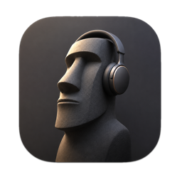
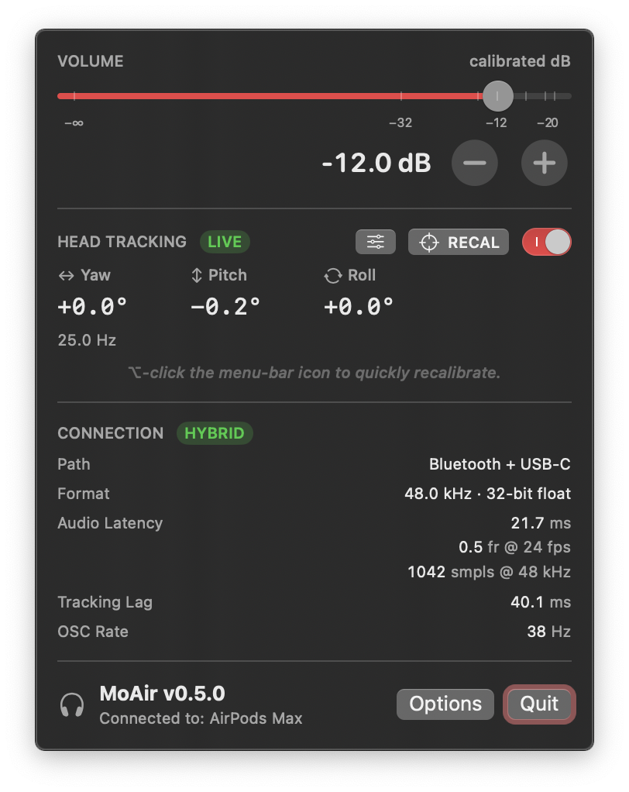

<p align="center">
  
</p>

# MoAir

> Tim just wants to use his headphones! macOS menubar utility: AirPods head tracking → spatial-audio OSC, plus professional, dB-accurate calibration.

<p align="center">
  
</p>

## Features

- Head tracking → OSC for **DAR**, **Apple ASAF**, **Nx**, **Mach1**, **Virtuoso** (or custom).
- Live volume in calibrated dB.
- Connection, Codec, latency, battery, latency, tracking stats at a glance.
- Fine tune head tracking with dead spots and sensitivity.

## Install

1. Download the latest [DMG](../../releases).
2. Drag MoAir into `/Applications`.
3. First launch grants Motion + Bluetooth.

Requires macOS 14+. USB-C wired tracking needs macOS 15.4+ and 2024 USB-C AirPods Max (firmware 7E101+).

## OSC

| Preset     | Address                   | Default port |
| ---------- | ------------------------- | ------------ |
| DAR        | `/ypr`, `/quaternion`     | 8000         |
| Apple ASAF | `/HeadPose`               | 8000         |
| Waves Nx   | `/nxosc/quaternion`       | 4242         |
| Mach1      | `/m1/orientation/*`       | 9898         |
| Virtuoso   | `/yaw`, `/pitch`, `/roll` | 8000         |
| Custom     | configurable              | configurable |

## Privacy

Local-only. No telemetry. The only network traffic is OSC to your configured host (default `127.0.0.1`).

## Hack on it

```
brew install just && just relaunch
```

## Support

If MoAir earned its keep, you can [buy me a cheeseburger](https://www.buymeacoffee.com/bootlegcheeseburger) 🍔.

<a href="https://www.buymeacoffee.com/bootlegcheeseburger"></a>

## License

[MIT](LICENSE) © 2026 Bootleg Cheeseburger, LLC
